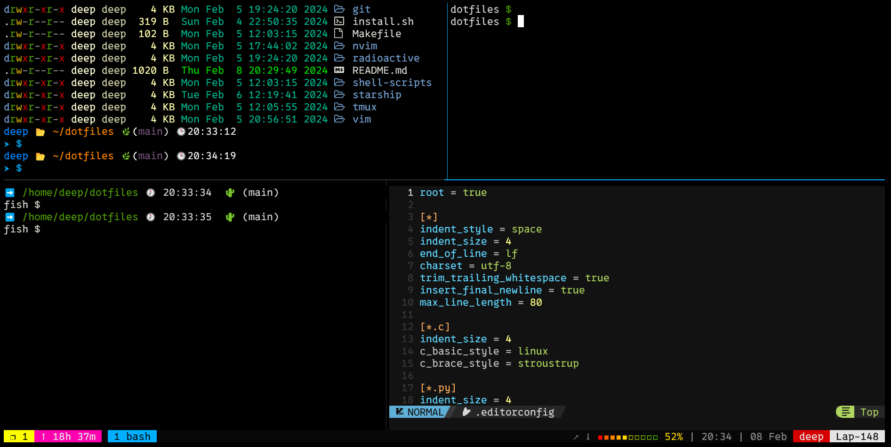

<p align=center>
  
</p>

# Dotfiles: Custom Linux Configuration

This repository contains my personalized configuration files for Linux. Each directory is tailored for different configs.

## How to Apply

Before applying the configurations, ensure you have GNU Stow installed.

Clone this repo into your home directory `~`

```bash
cd dotfiles
stow <package-name>
```

To override a package, deactivate the previous one using:

```bash
stow -D <old-package-name>
```

Apply the new configuration with:

```bash
stow <new-package-name>
```

This structure facilitates the coexistence of multiple configurations within a single directory.

## Default Packages

The default packages are enumerated in the `default-packages` file.

To apply all configurations, simply run:

```bash
make
```

## Required Tools

For seamless utilization of these configurations, refer to the `install.sh` file, which outlines the necessary tools:

- bat
- fzf
- ripgrep
- zoxide
- lsd
- glow
- thefuck
- tldr

## Other Useful Tools

In addition to the essential tools, consider exploring these supplementary utilities:

- portal
- share-cli

  -------------


